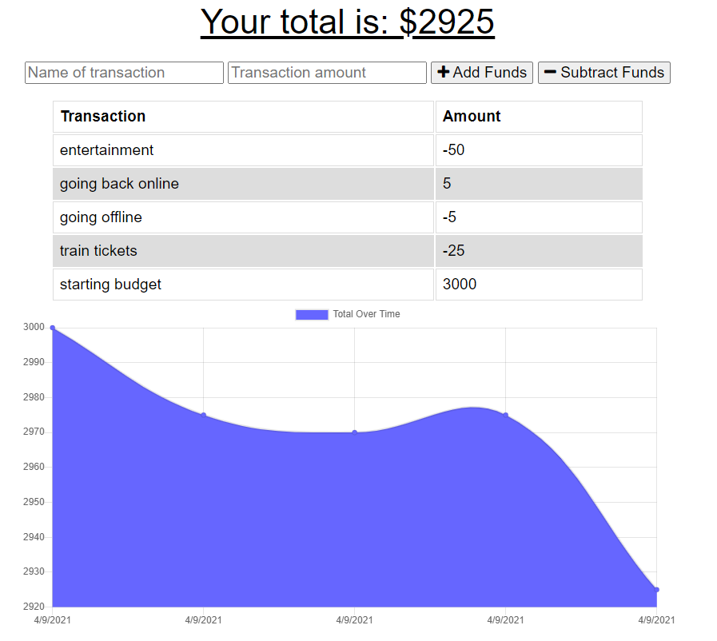
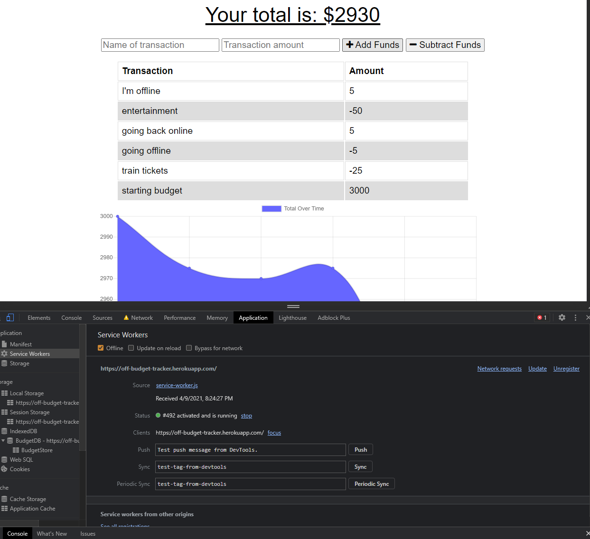

# On-N-Off-Budget-Tracker

License: 

## Description 

This application is for tracking your budget while you travel and it will work offline as well. Make sure to install the application on your devices for the next time you will be going somewhere where your internet might be spotty or non existent. 

Screenshots:

## Table of Contents

* [Installation](#installation)
* [Usage](#usage)
* [License](#license)
* [Contributing](#contributing)
* [Tests](#tests)
* [Questions](#questions)

## Installation

You can use the deployed application at the link below in this readme. Alternatively, you can install the application as PWA. 

## Usage 

Here are some features of this application. 

  - the application will run offline and online
  - you name the transaction and the transaction amount
  - you can add or minus the funds you have entered
  - funds are automatically calculated after you add or subtract the funds
  - the total running is on top of the application

Deployed: https://off-budget-tracker.herokuapp.com/

## License

MIT

## Contributing

If you would like to contribute to this project, you can fork a copy of the repo and make changes or improvements on your repo. Once ready, you can request a push and I will review the changes before updating the repo. 

## Tests

There are no tests with this application. Let me know if you are interested in creating a test for this application. 

## Questions

If you have any questions, feel free to contact me and listed below are my contact informations. 

GitHub profile: code-monkey713

Email: codemonkey713@gmail.com